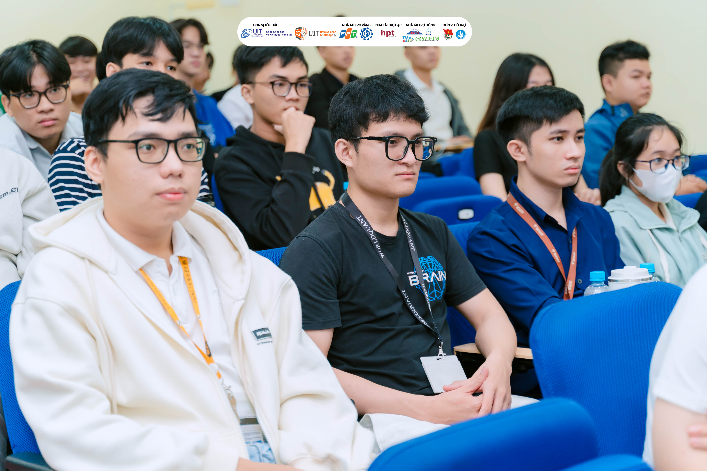

+++
title = "Trang chủ"
description = "Hồ sơ của JakeClark về Linux, CTF, và bầu trời AI."
+++

# Hé lô, tui là JakeClark 😎
Tên cha sinh mẹ đẻ: Nguyễn Chí Thành

- Hiện đang cày cuốc năm 4 ngành An toàn Thông tin ở Đại học Công nghệ Thông tin, ĐHQG-HCM (UIT).
- Gần đây tui đang thích vọc vạch ứng dụng Trí tuệ Nhân tạo (AI) vô đủ thứ trên đời, đỉnh nhất là dùng AI để tự động hoá mấy quy trình bảo mật với quản trị mạng cho nó mướt.
- Tui có đam mê mãnh liệt mổ xẻ mấy cái issue khó nhằn hiện nay, nhất là mấy lổ hổng ATTT, và mượn "tay" sức mạnh dời non lấp bể của AI để vả lại tụi nó.
- Châm ngôn sống: Khai phá maximum tiềm năng bản thân trong lĩnh vực ATTT, AI và xa hơn nữa để không bao giờ bị đuối trong cái thế giới công nghệ nhảy trend từng giây.

## Hành trang của tui (Experiences)

**Code dạo (Programming)**
- Ngôn ngữ: Múa rành Python với C/C++; biết sương sương JavaScript, C# và PHP.
- Web: Dày dặn kinh nghiệm cày ReactJS, Django, với Flask.
- App: Đã từng thầu nguyên con app C# .NET.

**Bảo mật (Cybersecurity)**
- CTF: Xỉa mỏ vô đủ từ chiến trường PicoCTF, RootMe, đến TryHackMe.
- Web Security: Đã đục bể 34% khoá học của PortSwigger Web Security Academy.
- Systems: Cầm trịch hệ thống Linux và Windows, lúc nào cũng rào chắn security kỹ càng.
- Tools: Tay to với con dao bầu rựa Kali Linux và mấy bảo bối như Burp Suite, ZAP, nmap.
- Solutions: Biết xài đồ chơi xịn như NGFW, EDR, SIEM (ELK Stack, Splunk), và IDS/IPS (Snort).

**Trí tuệ Nhân tạo (AI)**
- Models: Thấm thía đủ từ linear regression, random forest, clustering, anomaly detection, reinforcement learning cho tới cái sâu cay của deep learning.
- LLMs: Đang đu trend các anh lớn LLMs nội địa (Qwen, Llama) với đồ Tây nguyên chất (ChatGPT, Google Gemini).
- Integrations: Tui khoái trò build mấy con AI/LLM agents tự động code, tự fix bug security với setup workflow mượt mà nhờ n8n.

**DevOps (Thợ đụng)**
- Thợ mộc (Containerization): Sài khá mượt Docker và Docker Compose.
- Infra (IaC): Múa được Ansible.
- CI/CD: Jenkins tới bến luôn.

## Góc Flexing bản thân 📸

Tui (JakeClark) chụp ké với anh Luân siêu ngầu [@duyluandethuong](https://www.youtube.com/@duyluandethuong)

Tui đi tham gia Lễ bế mạc UIT Data Science Challenge (DSC) nè.

---

## 🚀 Thông tin cá nhân
- **[Projects](https://thanhnc.id.vn/projects/)** — Mấy cái project tui code dạo.
- **[FAQ](https://thanhnc.id.vn/faq/)** — Hỏi xoáy đáp xoay về tui.